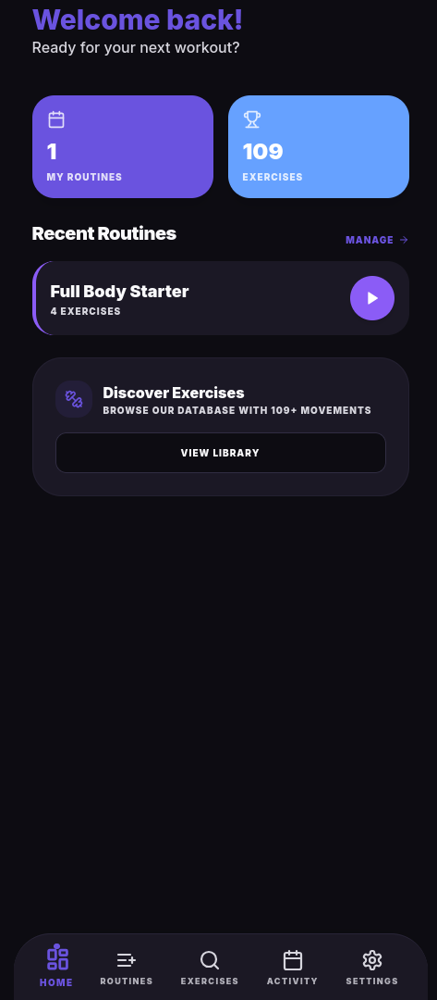
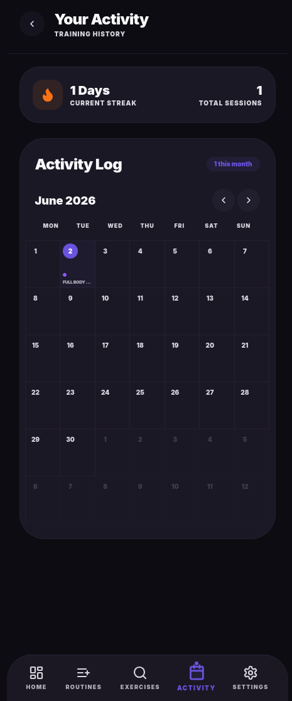
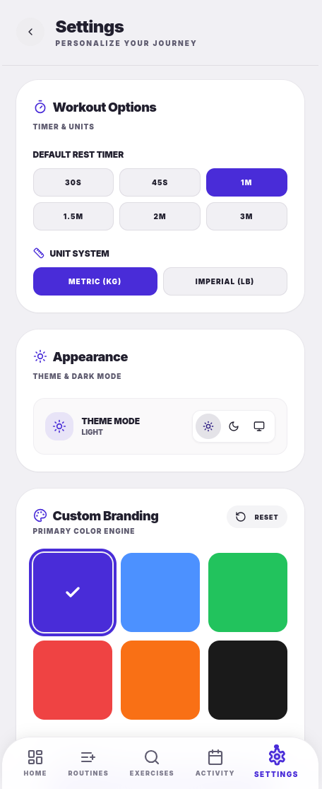

# GymTrackr

GymTrackr is a simple workout tracking app built with Next.js and packaged for Android with Capacitor.
It is designed as a local-only app with no login flow, so each installation can keep its own on-device data without requiring an account.

## Features

- Log workouts and exercises in a simple mobile-focused flow.
- Support exercises with optional duration per rep or set; when duration is used, weight should stay hidden during the active routine.
- Show a post-workout summary with duration, performed exercises, total volume, set count, muscle split, and record-style badges.
- Run as an Android app through Capacitor after syncing the built web app into the native Android project.

## Screenshots




## Stack

| Layer | Technology |
|---|---|
| App UI and logic | Next.js |
| Android wrapper | Capacitor |
| Native build flow | Gradle / Android Studio  |
| Data model | Local-only on-device storage approach |

## Project goals

GymTrackr focuses on speed, clarity, and offline-friendly personal use rather than accounts, social features, or cloud sync.
The project is intended to stay simple and practical for day-to-day workout logging on Android.

## Development workflow

1. Install dependencies with `npm install`.
2. Build the web app before syncing native changes; Capacitor expects an already built web bundle before `npx cap sync` copies assets into Android.
3. Sync the Android project with `npx cap sync android` after web changes or plugin updates.
4. Build a debug APK from the `android/` directory with `./gradlew assembleDebug`, or open the native project in Android Studio.

## Android notes

Adaptive and legacy launcher icons can be created in Android Studio's Image Asset Studio, which supports foreground and background layers for launcher icons.
When using Capacitor assets, the icon and splash workflow relies on generated native resource files for Android.

## Repository structure

```text
.
├─ android/
├─ app/ or src/
├─ public/
├─ package.json
├─ capacitor.config.*
└─ README.md
```

The exact web app structure may vary, but the Android project lives in `android/` and is updated from the web project through Capacitor sync commands.
## Build commands

```bash
npm install
npm run build
npx cap sync android
cd android
./gradlew assembleDebug
```

This is the standard Capacitor-style flow: build the web app first, then sync native assets and dependencies, then compile the Android app.

## Status

GymTrackr is an actively iterated personal Android fitness app project centered on fast workout logging and local ownership of data.
